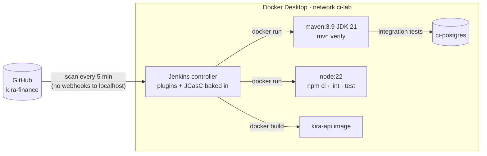

# Jenkins CI lab

A Jenkins server that runs on my own computer and is **defined entirely in code**: plugins, security, users and
jobs come from files in this repo, so `docker compose up` gives the same fully configured Jenkins every time, with no
setup wizard and no clicking through settings.

It builds my [Kira](https://github.com/amirizalrahmat0799/kira-finance) project (Spring Boot API + Expo app) from its
[`Jenkinsfile`](https://github.com/amirizalrahmat0799/kira-finance/blob/main/Jenkinsfile), alongside the same project's
GitHub Actions workflow.

## How it works



| Piece | What it does |
|---|---|
| [`jenkins/Dockerfile`](jenkins/Dockerfile) | Jenkins LTS (JDK 21) with the Docker CLI and the plugins from [`plugins.txt`](jenkins/plugins.txt) installed at build time |
| [`casc/jenkins.yaml`](casc/jenkins.yaml) | **Configuration as Code (JCasC)**: admin user from `.env`, login required, 2 executors, Jenkins URL, and which job scripts to load |
| [`jobs/kira-finance.groovy`](jobs/kira-finance.groovy) | **Job DSL**: a multibranch pipeline for kira-finance, so every branch with a `Jenkinsfile` is built |
| [`docker-compose.yml`](docker-compose.yml) | Jenkins on http://localhost:8090 plus a PostgreSQL for integration tests, on a shared `ci-lab` network |

### Builds run in throwaway containers

Jenkins only has the Docker CLI, no Maven or Node. Each step runs in a fresh official image started next to Jenkins:

```bash
docker run --rm --volumes-from jenkins --network ci-lab -w "$WORKSPACE/backend" maven:3.9-eclipse-temurin-21 mvn -B verify
```

- `--volumes-from jenkins` gives the container Jenkins' workspace, so it sees the checked-out code and Jenkins sees the results.
- `--network ci-lab` lets the integration tests reach `ci-postgres`.
- Named volumes (`ci-lab-m2`, `ci-lab-npm`) cache Maven and npm downloads between builds.

Switching JDK or Node version means changing one image tag, and nothing is installed on Jenkins itself.

### The Kira pipeline

```
Checks (parallel)
├── Backend
│   ├── Test database   create a fresh database for this build on ci-postgres
│   ├── Build & test    mvn verify: unit + integration tests (JUnit report, jar archived)
│   └── Docker image    docker build -t kira-api:<build number>
└── Mobile              npm ci · typecheck · lint · jest
post: drop the test database
```

Each executor gets its own database (`kira_ci_0`, `kira_ci_1`), so two branches building at once don't share test data.

## Running it

Needs Docker Desktop (with WSL 2 on Windows).

```bash
cp .env.example .env              # then set JENKINS_ADMIN_PASSWORD
docker compose up -d --build      # first build downloads Jenkins and plugins, a few minutes
```

1. Open **http://localhost:8090** and sign in with the admin user from `.env`.
2. Open **Kira finance** and click **Scan Multibranch Pipeline Now** (after that it re-scans every 5 minutes).
3. Open the `main` branch to watch the build. The first run is slower while Maven and npm fill their caches.

Stop it with `docker compose down`. Jobs and build history live in the `jenkins_home` volume and survive restarts;
`docker compose down -v` wipes everything for a clean start.

### Changing the configuration

Edit `casc/jenkins.yaml` or `jobs/*.groovy`, then run `docker compose restart jenkins`. Changes made in the web UI are
replaced by these files on the next start, which keeps the files the single source of truth.

To add a plugin, add it to `jenkins/plugins.txt` and run `docker compose up -d --build`.

## Security notes

This is a **local lab**, and some choices trade security for simplicity:

- Jenkins runs as root and has the host's Docker socket, which means full control of Docker on this machine. Never expose port 8090 to the internet.
- Builds run on the built-in node. A shared or production setup would run them on separate agents.
- The admin password lives in `.env` (git-ignored). A real setup would use a secret store and single sign-on.

## Troubleshooting

| Symptom | Fix |
|---|---|
| `Set JENKINS_ADMIN_PASSWORD in .env` | Copy `.env.example` to `.env` first |
| `permission denied ... docker.sock` | Make sure Docker Desktop is running and the compose file still has `user: root` |
| `No such container: ci-postgres` / `network ci-lab not found` | Start everything with `docker compose up`, not just the Jenkins container |
| Build can't find `pom.xml` | The Jenkins container must be named `jenkins` (`container_name` in the compose file) |
| Port 8090 already in use | Change the left side of `"8090:8080"` and `unclassified.location.url` in `casc/jenkins.yaml` |

## Roadmap

- Separate build agents (Docker cloud) instead of the built-in node
- Report build status back to GitHub commits (needs a GitHub token credential)
- Pipelines for payment-gateway-sim and payment-assistant
- Push images to a local registry and deploy to the kind cluster from [payment-gateway-k8s](https://github.com/amirizalrahmat0799/payment-gateway-k8s)

## License

[MIT](LICENSE)
