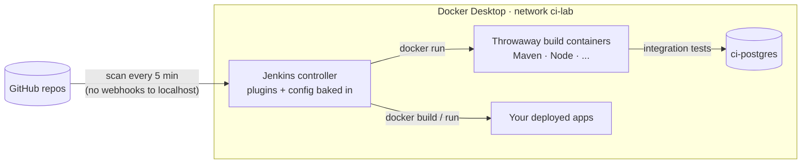

# Jenkins CI lab: starter CI/CD

A ready-to-run **Jenkins for your own computer**, defined entirely in code. Plugins, security, the admin user and
the jobs all come from files in this repo, so `docker compose up` gives you the same fully configured Jenkins every
time, with no setup wizard and no clicking through settings.

It's a starter kit for CI/CD: register a GitHub repo, drop in one of the [Jenkinsfile templates](#jenkinsfile-templates),
and every branch is built and tested, and `main` can be deployed as a container on your machine.

## What's inside



| Piece | What it does |
|---|---|
| [`jenkins/Dockerfile`](jenkins/Dockerfile) | Jenkins LTS (JDK 21) with the Docker CLI and the plugins from [`plugins.txt`](jenkins/plugins.txt) installed at build time |
| [`casc/jenkins.yaml`](casc/jenkins.yaml) | **Configuration as Code (JCasC)**: admin user from `.env`, login required, 2 executors, Jenkins URL, and which job scripts to load |
| [`jobs/projects.groovy`](jobs/projects.groovy) | **Job DSL**: the list of repos to build; each becomes a multibranch pipeline |
| [`templates/`](templates) | Starter `Jenkinsfile`s for common project types |
| [`docker-compose.yml`](docker-compose.yml) | Jenkins on http://localhost:8090 plus a PostgreSQL for integration tests, on a shared `ci-lab` network |

## Quick start

Needs Docker Desktop (with WSL 2 on Windows).

```bash
cp .env.example .env              # then set JENKINS_ADMIN_PASSWORD
docker compose up -d --build      # the first build downloads Jenkins and plugins, a few minutes
```

1. Open **http://localhost:8090** and sign in with the admin user from `.env`.
2. Open a project and click **Scan Multibranch Pipeline Now** (after that it re-scans every 5 minutes).
3. Open a branch to watch its build. First builds are slower while Maven and npm fill their caches.

Stop with `docker compose down`. Jobs and build history live in the `jenkins_home` volume and survive restarts;
`docker compose down -v` wipes everything for a clean start.

## Adding a project

1. **Add a `Jenkinsfile`** to the root of the repo. Start from a template below and push it.
2. **Register the repo** in [`jobs/projects.groovy`](jobs/projects.groovy):
   ```groovy
   [name: 'my-app', repo: 'https://github.com/<you>/my-app.git'],
   ```
3. **Reload:** `docker compose restart jenkins`, then click **Scan Multibranch Pipeline Now** on the new project.

Public repos need no credentials. For private repos, add a GitHub token as a credential in `casc/jenkins.yaml` and
reference it with `credentialsId` in the job script.

## Jenkinsfile templates

| Template | For | Stages |
|---|---|---|
| [`maven`](templates/maven/Jenkinsfile) | Java / Spring Boot | `mvn verify`, JUnit report, archive the jar |
| [`node`](templates/node/Jenkinsfile) | React, Vite, Expo, Express | `npm ci`, lint, test, build |
| [`maven-postgres`](templates/maven-postgres/Jenkinsfile) | Java with database integration tests | fresh PostgreSQL database per build, `mvn verify`, drop the database |
| [`docker-deploy`](templates/docker-deploy/Jenkinsfile) | Anything with a `Dockerfile` | build and tag the image on every branch; on `main`, replace the running container and smoke-test it |

Combine them freely. A typical pipeline is: tests (`maven-postgres` or `node`) → Docker image → deploy (`docker-deploy`).

### Conventions the templates rely on

- **Builds run in throwaway containers.** Jenkins only has the Docker CLI. Each step runs in a fresh official image:
  ```bash
  docker run --rm --volumes-from jenkins --network ci-lab -w "$WORKSPACE" maven:3.9-eclipse-temurin-21 mvn -B verify
  ```
  `--volumes-from jenkins` shares Jenkins' workspace with the container. Changing the JDK or Node version means
  changing one image tag, and nothing is installed on Jenkins itself.
- **Caches:** the named volumes `ci-lab-m2` and `ci-lab-npm` keep Maven and npm downloads between builds.
- **Databases:** `ci-postgres` (user `ci`, password `ci`) is reachable as `ci-postgres:5432` on the `ci-lab` network.
  Templates create one database per executor and drop it afterwards.
- **Deployments:** apps deployed by `docker-deploy` run on the same `ci-lab` network, so they can reach each other by
  container name, and are published on the host port you choose.

## Changing the configuration

Edit `casc/jenkins.yaml` or `jobs/*.groovy`, then run `docker compose restart jenkins`. Changes made in the web UI are
replaced by these files on the next start, which keeps the files the single source of truth.

To add a plugin, add it to `jenkins/plugins.txt` and run `docker compose up -d --build`.

## Security notes

This is a **local lab**, and some choices trade security for simplicity:

- Jenkins runs as root and has the host's Docker socket, which means full control of Docker on this machine. Never expose port 8090 to the internet.
- Builds run on the built-in node. A shared or production setup would run them on separate agents.
- The admin password lives in `.env` (git-ignored). A real setup would use a secret store and single sign-on.

## Troubleshooting

| Symptom | Fix |
|---|---|
| `Set JENKINS_ADMIN_PASSWORD in .env` | Copy `.env.example` to `.env` first |
| `permission denied ... docker.sock` | Make sure Docker Desktop is running and the compose file still has `user: root` |
| `No such container: ci-postgres` / `network ci-lab not found` | Start everything with `docker compose up`, not just the Jenkins container |
| Build can't find `pom.xml` / `package.json` | The Jenkins container must be named `jenkins`, and `APP_DIR` in the Jenkinsfile must point at the right folder |
| New project doesn't appear | Check the entry in `jobs/projects.groovy`, restart Jenkins, and look at the Jenkins log: `docker compose logs jenkins` |
| Port 8090 already in use | Change the left side of `"8090:8080"` and `unclassified.location.url` in `casc/jenkins.yaml` |

## Roadmap

- Separate build agents (Docker cloud) instead of the built-in node
- Report build status back to GitHub commits (needs a GitHub token credential)
- Webhooks through a tunnel (e.g. smee.io) instead of polling
- A local image registry, and deploying to a Kubernetes (kind) cluster

## License

[MIT](LICENSE)
